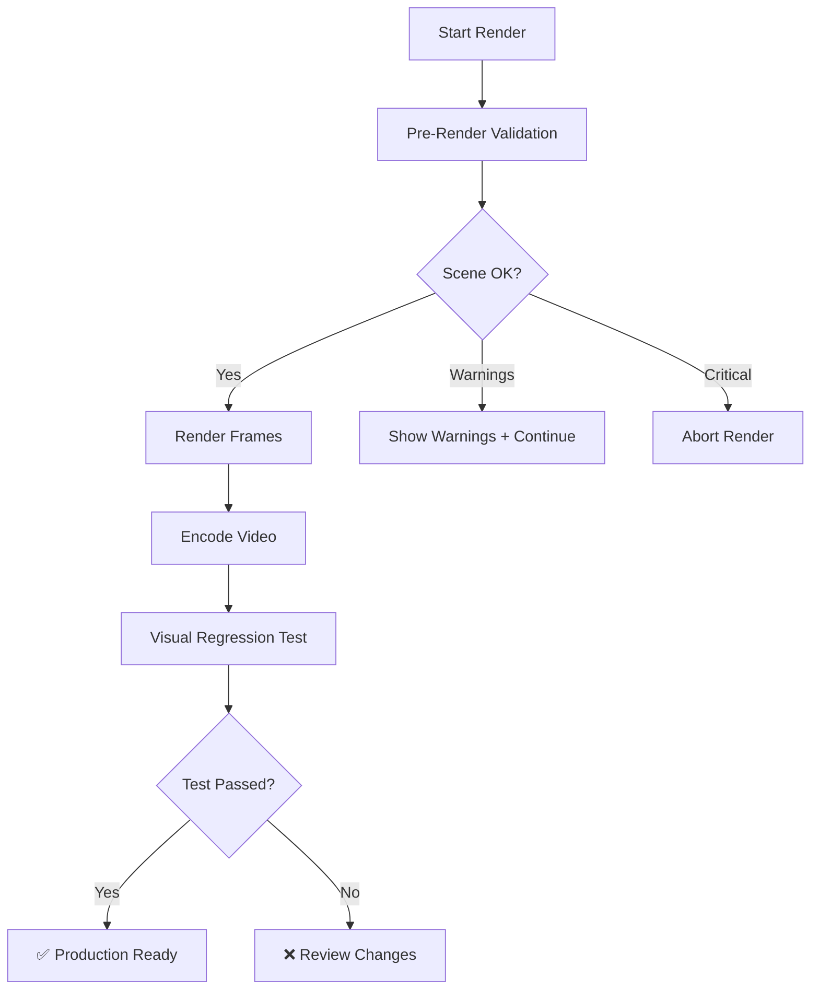

# Visual Regression Testing Guide

## Overview

The visual regression testing system prevents quality regressions by comparing new renders against validated reference frames ("golden images"). This catches:

- ✅ Material changes (wrong materials applied)
- ✅ Scene changes (unwanted objects visible)
- ✅ Lighting changes
- ✅ Camera/composition changes
- ✅ Quality degradation

## Quick Start

### 1. Capture Reference Images

```bash
# Capture reference frames for dadosfera project
python3 scripts/visual_regression_test.py --project dadosfera --capture-reference

# Capture custom frames
python3 scripts/visual_regression_test.py --project dadosfera \
  --capture-reference --frames 1 30 60 120 240
```

This renders specified frames with your current scene and stores them as the "correct" reference.

### 2. Run Regression Test

```bash
# Test latest render against reference
python3 scripts/visual_regression_test.py --project dadosfera --test

# Test specific render directory
python3 scripts/visual_regression_test.py --project dadosfera \
  --test --render-dir projects/dadosfera/renders/20251004_1549_*
```

## Pre-Render Validation

The render pipeline now includes automatic scene validation:

```bash
# Validation runs automatically in render_production.py
python3 scripts/render_production.py dadosfera --quality production
```

### Manual Scene Cleaning

To manually clean a scene:

```bash
# Dry-run (check only)
blender scene.blend --background \
  --python scripts/clean_production_scene.py -- --dry-run

# Apply fixes and save
blender scene.blend --background \
  --python scripts/clean_production_scene.py -- --output scene.blend
```

**What it checks:**
- ❌ Ground planes and test geometry
- ❌ Debug objects (test_, debug_, temp_, placeholder_)
- ❌ Forbidden materials on wrong objects
- ❌ Camera setup issues

## Validation Workflow

### Standard Production Render



### Typical Workflow

```bash
# 1. Clean the scene (if needed)
blender scene.blend --background \
  --python scripts/clean_production_scene.py -- --output scene.blend

# 2. Capture reference (first time only)
python3 scripts/visual_regression_test.py --project dadosfera --capture-reference

# 3. Render with automatic validation
python3 scripts/render_production.py dadosfera --quality production

# 4. Run regression test
python3 scripts/visual_regression_test.py --project dadosfera --test
```

## Test Results

### Interpreting Results

```
📊 REGRESSION TEST RESULTS
============================================================
   Frames tested: 3
   Frames identical: 2
   Average similarity: 98.5%
   Threshold: 95.0%
   Status: ✅ PASSED
============================================================
```

- **Identical**: Pixel-perfect match (hash match)
- **Similarity**: % similarity score (size and hash based)
- **Threshold**: Configurable pass/fail threshold (default 95%)

### Results Files

Test results are saved to:
```
tests/visual_regression/{project}/results/{render_name}/
├── test_results.json          # Full test results with metrics
└── (future: diff images)
```

## Configuration

### Similarity Threshold

Adjust the threshold based on your needs:

```bash
# Strict: 99% similarity required
python3 scripts/visual_regression_test.py --project dadosfera \
  --test --threshold 0.99

# Lenient: 90% similarity required
python3 scripts/visual_regression_test.py --project dadosfera \
  --test --threshold 0.90
```

### Custom Reference Frames

```bash
# Capture specific keyframes
python3 scripts/visual_regression_test.py --project dadosfera \
  --capture-reference --frames 1 50 100 150 200 240
```

## CI/CD Integration

### Pre-Commit Hook

Add to `.git/hooks/pre-commit`:

```bash
#!/bin/bash
# Validate taxonomy and scene structure before commit

# Check if blend files were modified
if git diff --cached --name-only | grep -q '\.blend$'; then
    echo "🔍 Validating Blender scenes..."
    
    # Run scene validation on modified blend files
    for blend_file in $(git diff --cached --name-only | grep '\.blend$'); do
        blender "$blend_file" --background \
          --python scripts/clean_production_scene.py -- --dry-run
        
        if [ $? -ne 0 ]; then
            echo "❌ Scene validation failed: $blend_file"
            echo "   Run: blender $blend_file --background --python scripts/clean_production_scene.py -- --output $blend_file"
            exit 1
        fi
    done
fi
```

### Jenkins Pipeline

```groovy
stage('Visual Regression Test') {
    steps {
        script {
            // Render test frames
            sh 'python3 scripts/render_production.py dadosfera --quality preview --frames 1 48'
            
            // Run regression test
            def result = sh(
                script: 'python3 scripts/visual_regression_test.py --project dadosfera --test',
                returnStatus: true
            )
            
            if (result != 0) {
                error("Visual regression test failed")
            }
        }
    }
}
```

## Troubleshooting

### Reference Images Not Found

```bash
❌ No reference images found for dadosfera
   Run with --capture-reference first
```

**Solution**: Capture reference images first:
```bash
python3 scripts/visual_regression_test.py --project dadosfera --capture-reference
```

### Scene Validation Warnings

```bash
⚠️  Found 1 issues
   (Dry run - no changes made)
```

**Solution**: Apply scene fixes:
```bash
blender scene.blend --background \
  --python scripts/clean_production_scene.py -- --output scene.blend
```

### Low Similarity Score

```bash
❌ frame_0001... 72.5% similar (below threshold)
```

**Possible causes:**
1. Intentional scene changes (materials, lighting)
2. Different quality settings
3. Random noise/particles
4. Render engine differences

**Solution**: 
- Review changes in the scene
- Update reference if changes are intentional
- Adjust threshold if needed

## Best Practices

### 1. Update References After Validated Changes

When you make intentional improvements:

```bash
# 1. Render with new changes
python3 scripts/render_production.py dadosfera --quality production

# 2. Verify quality manually
# 3. Re-capture reference with improved version
python3 scripts/visual_regression_test.py --project dadosfera --capture-reference
```

### 2. Test Before Production

Always run regression tests before final production renders:

```bash
# Preview quality test (fast)
python3 scripts/render_production.py dadosfera --quality preview --frames 1 48
python3 scripts/visual_regression_test.py --project dadosfera --test

# If passed, run production
python3 scripts/render_production.py dadosfera --quality production
```

### 3. Multiple Reference Sets

Consider maintaining multiple reference sets for different contexts:

```
tests/visual_regression/dadosfera/
├── reference/              # Current production standard
├── reference_v1/           # Legacy version
└── reference_experimental/ # Development version
```

## Future Enhancements

Planned improvements:

- [ ] Perceptual hash comparison (SSIM, MSE)
- [ ] Visual diff image generation (side-by-side + difference map)
- [ ] Machine learning-based quality assessment
- [ ] Automatic slack/email notifications on failure
- [ ] Multi-camera angle testing
- [ ] Animation sequence validation (motion blur, timing)

## Related Documentation

- [Rendering Guide](rendering-guide.md)
- [Quality Presets](../project/README.md)
- [Taxonomy Standards](../project/TAXONOMY.md)
- [CI/CD Pipeline](../setup/jenkins.md)
