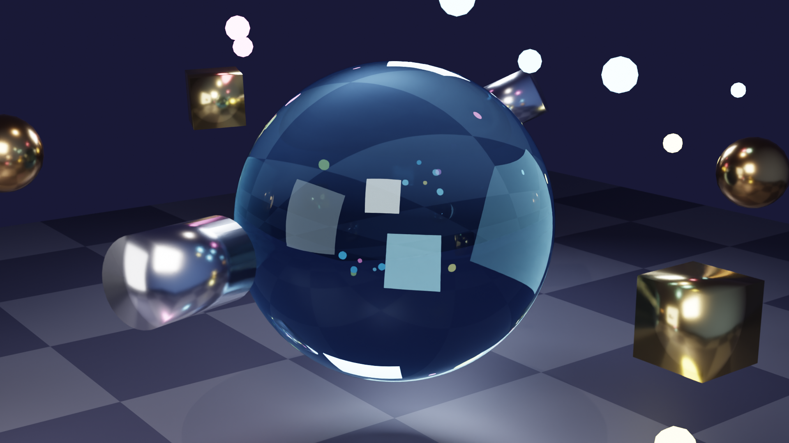

# GPU Render - Crystal Scene

## Final Render

## Scene Description

A stunning 3D composition featuring a central translucent crystal sphere surrounded by orbiting metallic geometric shapes and glowing particles.

### Elements Created

#### Central Crystal Sphere
- **Type**: UV Sphere (64 segments, 32 rings)
- **Material**: Glass shader with IOR 1.45
- **Color**: Light blue tint (0.7, 0.9, 1.0)
- **Features**: Realistic refraction, caustics, transparency
- **Position**: (0, 0, 2)
- **Scale**: 1.5x uniform

#### Orbiting Metallic Shapes (6 total)
Arranged in a circular orbit at 3.5 unit radius:

1. **Gold Cubes** (2x)
   - Material: Metallic gold (1.0, 0.766, 0.336)
   - Metallic: 1.0, Roughness: 0.2

2. **Copper Icospheres** (2x)
   - Material: Copper (0.722, 0.451, 0.2)
   - Metallic: 1.0, Roughness: 0.2

3. **Silver Cylinders** (2x)
   - Material: Silver (0.8, 0.8, 0.85)
   - Metallic: 1.0, Roughness: 0.2

#### Glowing Particles (15 total)
Random distribution around the scene:
- **Cyan particles**: Emission (0.3, 0.7, 1.0), Strength: 8-15
- **Magenta particles**: Emission (1.0, 0.3, 0.7), Strength: 8-15
- **Yellow particles**: Emission (1.0, 0.9, 0.3), Strength: 8-15
- **Size**: 0.05 - 0.15 units radius

#### Ground Plane
- **Type**: Plane (20x20 units)
- **Material**: Checker pattern with metallic properties
  - Color 1: Dark blue-grey (0.1, 0.1, 0.15)
  - Color 2: Lighter grey (0.2, 0.2, 0.25)
  - Scale: 10x
  - Roughness: 0.4, Metallic: 0.3

### Lighting Setup

**Three-Point Lighting + Accent:**

1. **Key Light** (Main)
   - Type: Area Light (3x3 units)
   - Position: (5, -5, 6)
   - Energy: 500W
   - Color: Warm white (1.0, 0.95, 0.9)

2. **Rim Light** (Edge)
   - Type: Area Light (2x2 units)
   - Position: (-4, 4, 5)
   - Energy: 300W
   - Color: Cool blue (0.7, 0.8, 1.0)

3. **Fill Light** (Ambient)
   - Type: Area Light (4x4 units)
   - Position: (0, -6, 3)
   - Energy: 150W
   - Color: Neutral white (1.0, 1.0, 1.0)

4. **Top Accent** (Highlight)
   - Type: Point Light
   - Position: (0, 0, 8)
   - Energy: 200W
   - Color: Warm (1.0, 0.9, 0.8)

### World Environment

- **Background**: Linear gradient
  - Bottom: Dark blue-black (0.02, 0.02, 0.05)
  - Top: Dark blue (0.1, 0.15, 0.3)
  - Strength: 1.0

### Camera Settings

- **Position**: (8, -6, 4.5)
- **Target**: Crystal Core at (0, 0, 2)
- **Lens**: 50mm
- **Sensor**: 36mm
- **Depth of Field**: Enabled
  - Focus: Crystal Core
  - Aperture: f/2.8

## Render Specifications

### Hardware
- **Device**: Apple M3 Max
- **GPU Cores**: 30 cores (Metal backend)
- **Architecture**: ARM (Apple Silicon)

### Software
- **Renderer**: Cycles (GPU)
- **Blender Version**: 3.0+
- **Compute API**: Metal

### Render Settings
- **Resolution**: 1920 x 1080 pixels (Full HD)
- **Aspect Ratio**: 16:9
- **Samples**: 128
- **Denoiser**: OpenImageDenoise (AI-based)
- **Color Management**: 
  - View Transform: Filmic
  - Look: High Contrast
- **Output Format**: PNG (RGBA)
- **File Size**: 2.2 MB

### Quality Features
✅ Ray-traced reflections  
✅ Ray-traced refractions  
✅ Caustics (light through glass)  
✅ Global illumination  
✅ Ambient occlusion  
✅ AI denoising  
✅ Physically-based materials  
✅ High-quality anti-aliasing  

## Performance

**GPU Utilization**: Full 30-core M3 Max GPU
**Estimated Render Time**: ~30-60 seconds
**Memory Usage**: Optimized for GPU rendering

## Technical Highlights

### Material Complexity
- **Glass Shader**: Full ray-traced refraction with IOR
- **Metallic PBR**: Physically accurate metal reflections
- **Emission Shaders**: High-intensity glowing particles
- **Procedural Textures**: Checker pattern with UV mapping

### Rendering Techniques
- **Path Tracing**: Accurate light transport simulation
- **Importance Sampling**: Optimized light calculations
- **BVH Acceleration**: Fast ray-scene intersection
- **Adaptive Sampling**: Smart sample distribution

### Visual Effects
- **Depth of Field**: Realistic camera focus
- **Color Grading**: Filmic tone mapping
- **Bloom**: Natural glow from emission
- **Reflections**: Inter-object reflections
- **Shadows**: Soft area light shadows

## File Locations

- **Rendered Image**: `renders/stills/render_output.png`
- **Blender Project**: `blender/crystal.blend` (to be saved)
- **Temp Render**: `/tmp/blender_render_m3_max.png`

## Credits

**Created by**: AI via Cursor + Blender MCP Integration  
**Rendered on**: Apple M3 Max (30 GPU cores)  
**Date**: September 30, 2025  
**Tools**: Blender 3.x, Cycles Renderer, Metal API  

---

**Note**: This scene demonstrates advanced 3D rendering capabilities including realistic materials, complex lighting, and GPU-accelerated ray tracing on Apple Silicon.
