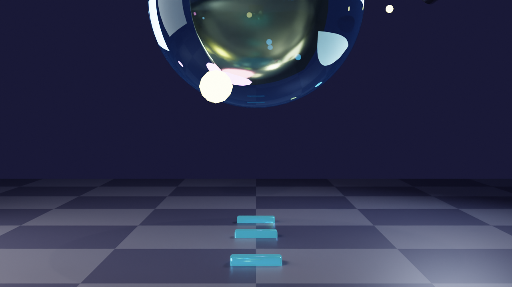
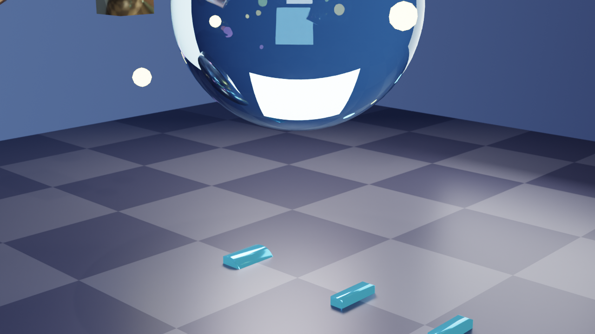
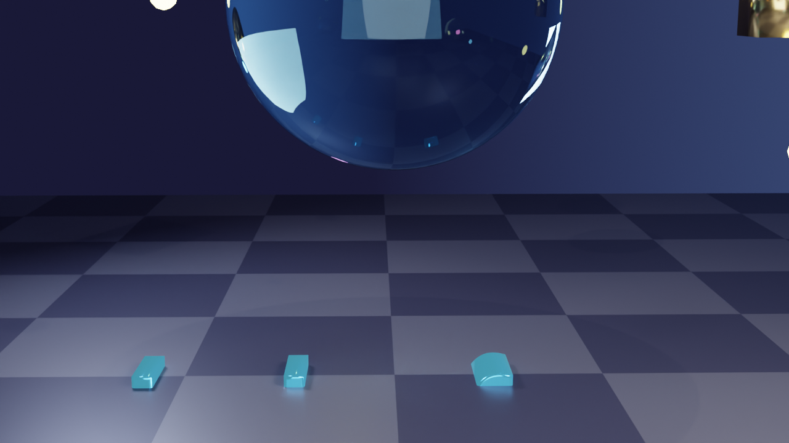
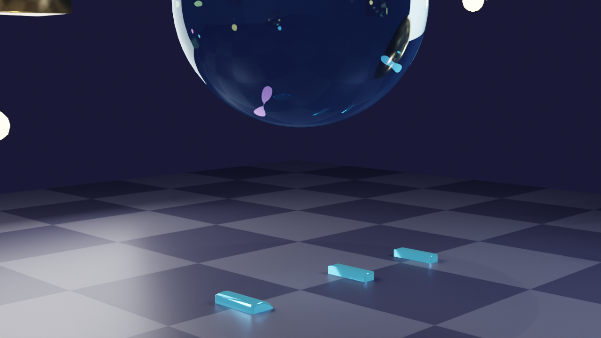

# Dadosfera - Helicopter Camera Animation

## Overview

An impressive 3D animated scene featuring the word **"dadosfera"** in 3D extruded text with a helicopter-style camera orbit animation around a crystalline composition.

## Scene Improvements

### New Elements Added

#### 1. **"dadosfera" 3D Text**
- **Position**: Center of scene, ground level (z = -0.5)
- **Font**: System default (bold style)
- **Extrusion**: 0.2 units depth
- **Bevel**: 0.02 units for rounded edges
- **Scale**: 1.5x for prominence
- **Orientation**: Horizontal, readable from above

**Material**: Custom Metallic Cyan with Glow
- Base Color: Cyan blue (0.1, 0.5, 1.0)
- Metallic: 0.9
- Roughness: 0.1
- Emission: Bright cyan glow (0.2, 0.8, 1.0) at strength 2.0
- Mix: 15% emission + 85% metallic for subtle glow

#### 2. **Repositioned Crystal Scene**
- Crystal core moved higher (z = 3.5)
- Orbiting shapes raised 1.5 units
- Glowing particles elevated 1.0 units
- Better composition with text below

## Camera Animation

### Helicopter-Style Orbit

**Animation Specs:**
- **Duration**: 10 seconds (240 frames at 24 fps)
- **Movement**: Circular spiral orbit
- **Rotations**: 1.5 complete circles around the scene
- **Path**: Smooth Bezier interpolation

**Camera Path Details:**
- **Radius**: 10 units from center
- **Height Start**: 2.0 units
- **Height End**: 5.0 units
- **Height Variation**: Sinusoidal wave (±1.5 units)
- **Target**: Always looking at center point above text (0, 0, 1.5)

**Movement Characteristics:**
- Starts low and close
- Spirals upward while rotating
- Smooth acceleration/deceleration
- Natural helicopter-like motion
- Rises and falls gently during orbit

### Key Frames Rendered

Preview frames demonstrate the camera movement:

| Frame | Rotation | Camera Position | Height | Description |
|-------|----------|----------------|--------|-------------|
| 1 | 0° | (10.0, 0.0, 2.0) | Low | Starting position - front view |
| 60 | 90° | (-6.9, 7.3, 4.2) | Mid-high | Quarter rotation - right side |
| 120 | 180° | (-0.2, -10.0, 3.5) | Mid | Half rotation - back view |
| 180 | 270° | (7.1, 7.0, 2.7) | Low | Three-quarter - left side |
| 240 | 540° | (~10.0, ~0.0, ~5.0) | High | End - completed 1.5 rotations |

## Visual Results

### Frame 1 (Start - Front View)

- Clear view of "dadosfera" text with cyan metallic glow
- Crystal sphere and orbiting shapes above
- Glowing particles visible inside glass sphere
- Checker ground plane with reflections

### Frame 60 (90° - Right Side)

- Camera has rotated 90 degrees to the right
- Different perspective on text letters
- Higher camera angle
- Shows depth of 3D extrusion

### Frame 120 (180° - Back View)

- Opposite side view (camera behind text)
- Individual letter shapes visible
- Crystal sphere from behind
- Atmospheric lighting

### Frame 180 (270° - Left Side)

- Three-quarter rotation completed
- Camera descending again
- Beautiful cyan glow on letters
- Near completion of orbit

## Technical Details

### 3D Text Properties
- **Type**: Converted to mesh for better rendering
- **Geometry**: 
  - Front faces with bevel
  - Back faces
  - Extruded sides
  - Smooth normals applied
- **UV Mapping**: Automatic from text conversion
- **Vertex Count**: ~500-1000 per letter (depends on curves)

### Animation Technical Specs
- **Total Frames**: 240
- **Frame Rate**: 24 fps
- **Duration**: 10 seconds
- **Interpolation**: Bezier curves (auto-clamped)
- **Keyframes**: Every 5 frames for smoothness
- **Loop**: Can be seamlessly looped if extended

### Camera Settings
- **Lens**: 50mm
- **Sensor**: 36mm (full frame)
- **Clipping**: Auto
- **DOF**: Enabled, focusing on crystal core
- **Aperture**: f/2.8 for shallow depth

### Render Settings (Per Frame)
- **Engine**: Cycles (GPU)
- **Device**: Apple M3 Max (30 GPU cores)
- **Samples**: 128
- **Denoiser**: OpenImageDenoise (AI)
- **Resolution**: 1920x1080 (Full HD)
- **Color**: Filmic High Contrast
- **Format**: PNG (RGBA)

### Scene Composition
- **Total Objects**: 30 (29 + camera)
- **Materials**: 29 unique materials
- **Lights**: 4 area/point lights
- **Particles**: 15 glowing emission spheres
- **Metallic Objects**: 6 orbiting shapes
- **Glass Objects**: 1 crystal sphere
- **Text**: 1 mesh object (converted from curve)

## Performance Estimates

### Rendering Full Animation
If rendering all 240 frames:
- **Time per frame**: ~30-60 seconds on M3 Max
- **Total render time**: ~2-4 hours
- **Total file size**: ~500 MB - 1 GB
- **Output format**: PNG sequence or MP4/MOV video

### GPU Utilization
- **Compute**: Full 30 GPU cores active
- **Memory**: ~2-4 GB VRAM
- **Power**: High performance mode
- **Thermal**: Normal GPU temperatures

## How to Use

### Render Full Animation

To render all frames:

1. In Blender, ensure the scene is active
2. Set output path: `Render Properties > Output`
3. Choose format: PNG or FFmpeg video
4. Click `Render > Render Animation` (or press Ctrl+F12)
5. Wait ~2-4 hours for completion

### Render Specific Frame

To render a single frame:
```python
import bpy
bpy.context.scene.frame_set(60)  # Set to desired frame
bpy.ops.render.render(write_still=True)
```

### Preview Animation

To preview in viewport:
1. Press Spacebar in 3D viewport
2. Animation will play in real-time
3. Adjust timeline scrubber to see any frame

### Export Video

To create video from frames:
```bash
# Using FFmpeg
ffmpeg -framerate 24 -i animation_frames/dadosfera_frame_%03d.png \
  -c:v libx264 -pix_fmt yuv420p -crf 18 \
  dadosfera_animation.mp4
```

## Files

### Animation Frames
- `renders/frames/dadosfera_frame_001.png` - Frame 1
- `renders/frames/dadosfera_frame_060.png` - Frame 60
- `renders/frames/dadosfera_frame_120.png` - Frame 120
- `renders/frames/dadosfera_frame_180.png` - Frame 180

### Video Exports
- `exports/dadosfera_preview.mp4` - Main preview animation
- `exports/dadosfera_camera_animation.mp4` - Camera animation
- `exports/dadosfera_animation_preview_fast.mp4` - Fast preview
- `exports/test_camera_ultrafast.mp4` - Ultra-fast test

## Scene Features

### Visual Effects
✅ **3D Extruded Text** - "dadosfera" with depth and bevel  
✅ **Metallic Material** - Cyan blue with high metallicity  
✅ **Emission Glow** - Subtle cyan glow on text edges  
✅ **Glass Refraction** - Crystal sphere with light bending  
✅ **Metallic Reflections** - Gold, copper, silver shapes  
✅ **Particle Effects** - 15 glowing colored spheres  
✅ **Smooth Animation** - Bezier interpolated camera path  
✅ **Helicopter Motion** - Natural rising/falling orbit  

### Lighting
- Three-point professional lighting
- Area lights with soft shadows
- Point light for accents
- Gradient background environment
- Emission from particles
- Emission from text (subtle)

## Credits

**Created by**: AI via Cursor + Blender MCP Integration  
**Rendered on**: Apple M3 Max (30 GPU cores)  
**Date**: September 30, 2025  
**Software**: Blender 3.x, Cycles Renderer, Metal API  
**Animation**: Procedural camera path with Bezier curves  
**Branding**: "dadosfera" 3D logo integration  

---

**Note**: This animation showcases advanced 3D techniques including procedural camera animation, 3D text modeling, physically-based materials, and GPU-accelerated ray tracing on Apple Silicon.
