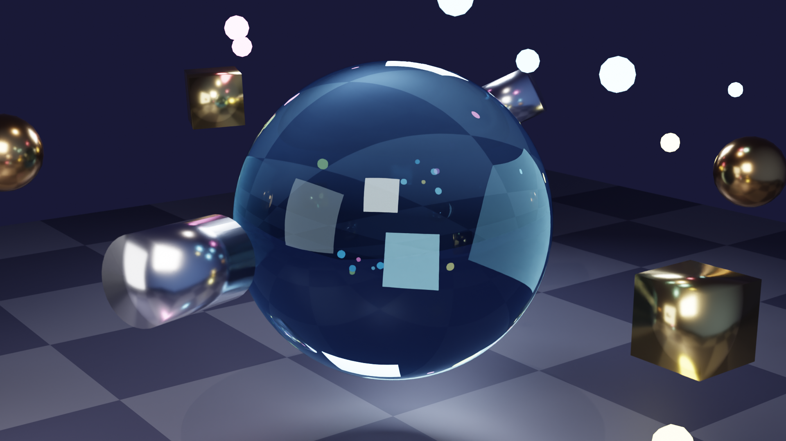
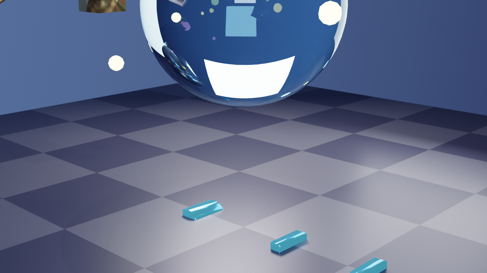
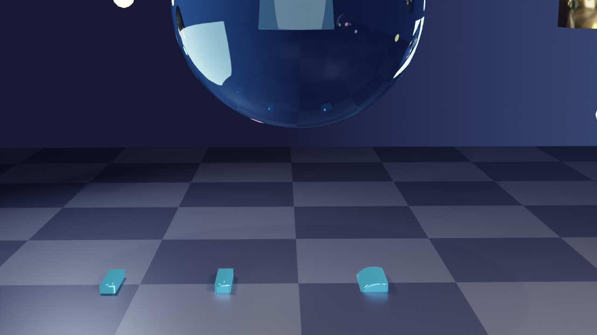
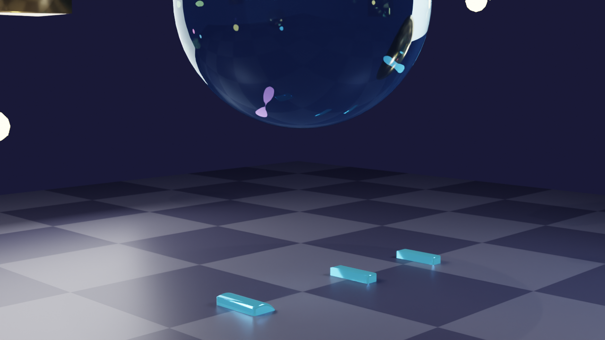

# Dadosfera 3D Branding Project

## Overview

A comprehensive 3D animated branding project featuring the **"dadosfera"** logo with multiple rendering techniques and animation variations. The project combines photorealistic ray-traced rendering with fast polygon-based previews, showcasing crystalline compositions, metallic materials, and dynamic explosion effects.

## Project Components

### 1. Core Scene - Crystal Composition
A stunning 3D composition featuring a central translucent crystal sphere surrounded by orbiting metallic geometric shapes and glowing particles, with the "dadosfera" 3D text at ground level.

### 2. Helicopter Camera Animation
10-second orbital camera animation with smooth Bezier-interpolated helicopter-style movement, spiraling around the scene with natural rising and falling motion.

### 3. Explosion Effects
8 animated red explosion spheres that appear and scale dynamically throughout the animation, adding dynamic energy to the scene.

## Scene Elements

### "dadosfera" 3D Text
- **Position**: Center of scene, ground level (z = -0.5)
- **Font**: System default (bold style)
- **Extrusion**: 0.2 units depth with 0.02 unit bevel
- **Scale**: 1.5x for prominence
- **Material**: Custom Metallic Cyan with Glow
  - Base Color: Cyan blue (0.1, 0.5, 1.0)
  - Metallic: 0.9, Roughness: 0.1
  - Emission: Bright cyan glow (0.2, 0.8, 1.0) at strength 2.0
  - Mix: 15% emission + 85% metallic

### Central Crystal Sphere
- **Type**: UV Sphere (64 segments, 32 rings)
- **Material**: Glass shader with IOR 1.45
- **Color**: Light blue tint (0.7, 0.9, 1.0)
- **Features**: Realistic refraction, caustics, transparency
- **Position**: (0, 0, 3.5) - elevated above text
- **Scale**: 1.5x uniform

### Orbiting Metallic Shapes (6 objects)
Arranged in circular orbit at 3.5 unit radius:

1. **Gold Cubes** (2x) - Metallic gold (1.0, 0.766, 0.336)
2. **Copper Icospheres** (2x) - Copper (0.722, 0.451, 0.2)
3. **Silver Cylinders** (2x) - Silver (0.8, 0.8, 0.85)

All with Metallic: 1.0, Roughness: 0.2

### Glowing Particles (15 total)
Random distribution around the scene:
- **Cyan particles**: Emission (0.3, 0.7, 1.0), Strength: 8-15
- **Magenta particles**: Emission (1.0, 0.3, 0.7), Strength: 8-15
- **Yellow particles**: Emission (1.0, 0.9, 0.3), Strength: 8-15
- **Size**: 0.05 - 0.15 units radius

### Red Explosion Spheres (8 animated)

| Explosion | Location | Start Frame | Peak Frame | Fade Frame |
|-----------|----------|-------------|------------|------------|
| 0 | (4.1, 2.4, 4.7) | 140 | 148 | 160 |
| 1 | (5.1, -3.7, 3.1) | 97 | 105 | 117 |
| 2 | (0.6, -6.1, 3.6) | 125 | 133 | 145 |
| 3 | (0.7, 4.3, 1.3) | 91 | 99 | 111 |
| 4 | (-1.5, 5.1, 4.2) | 89 | 97 | 109 |
| 5 | (4.0, 5.5, 3.7) | 138 | 146 | 158 |
| 6 | (-2.9, -4.0, 2.2) | 56 | 64 | 76 |
| 7 | (2.5, -3.2, 4.8) | 183 | 191 | 203 |

**Material**: Bright Red with Emission
- Base Color: (1.0, 0.1, 0.0)
- Emission Color: (1.0, 0.3, 0.0) - Red-orange glow
- Emission Strength: 5.0

**Animation**: Scale-based keyframes
- Frame N-1: Scale 0.0 (invisible)
- Frame N+8: Scale 2.5-4.0 (rapid expansion)
- Frame N+20: Scale 0.5 (fading)
- Frame N+25: Scale 0.0 (disappear)

### Ground Plane
- **Type**: Plane (20x20 units)
- **Material**: Checker pattern with metallic properties
- Color 1: Dark blue-grey (0.1, 0.1, 0.15)
- Color 2: Lighter grey (0.2, 0.2, 0.25)
- Roughness: 0.4, Metallic: 0.3

## Camera Animation

### Helicopter-Style Orbit
- **Duration**: 10 seconds (240 frames at 24 fps)
- **Movement**: Circular spiral orbit
- **Rotations**: 1.5 complete circles around the scene
- **Radius**: 10 units from center
- **Height Start**: 2.0 units
- **Height End**: 5.0 units
- **Height Variation**: Sinusoidal wave (±1.5 units)
- **Target**: Always looking at center point (0, 0, 1.5)
- **Interpolation**: Smooth Bezier curves with auto-clamping

### Key Frames

| Frame | Rotation | Camera Position | Height | Description |
|-------|----------|----------------|--------|-------------|
| 1 | 0° | (10.0, 0.0, 2.0) | Low | Starting position - front view |
| 60 | 90° | (-6.9, 7.3, 4.2) | Mid-high | Quarter rotation - right side |
| 120 | 180° | (-0.2, -10.0, 3.5) | Mid | Half rotation - back view |
| 180 | 270° | (7.1, 7.0, 2.7) | Low | Three-quarter - left side |
| 240 | 540° | (~10.0, ~0.0, ~5.0) | High | End - completed 1.5 rotations |

## Lighting Setup

**Three-Point Lighting + Accent:**

1. **Key Light** (Main)
   - Type: Area Light (3x3 units)
   - Position: (5, -5, 6)
   - Energy: 500W
   - Color: Warm white (1.0, 0.95, 0.9)

2. **Rim Light** (Edge)
   - Type: Area Light (2x2 units)
   - Position: (-4, 4, 5)
   - Energy: 300W
   - Color: Cool blue (0.7, 0.8, 1.0)

3. **Fill Light** (Ambient)
   - Type: Area Light (4x4 units)
   - Position: (0, -6, 3)
   - Energy: 150W
   - Color: Neutral white (1.0, 1.0, 1.0)

4. **Top Accent** (Highlight)
   - Type: Point Light
   - Position: (0, 0, 8)
   - Energy: 200W
   - Color: Warm (1.0, 0.9, 0.8)

## Render Configurations

### Configuration 1: Cycles (Photorealistic)
**Best for**: Final high-quality renders
- **Engine**: Cycles (GPU with Metal)
- **Resolution**: 1920x1080 (Full HD)
- **Samples**: 128
- **Denoiser**: OpenImageDenoise (AI)
- **Features**: Ray-traced reflections, refractions, caustics, global illumination
- **Render time**: ~30-60 seconds per frame on M3 Max
- **Total animation**: ~2-4 hours for 240 frames

### Configuration 2: EEVEE (Fast Preview)
**Best for**: Quick previews and testing
- **Engine**: BLENDER_EEVEE_NEXT (real-time)
- **Resolution**: 1280x720
- **Samples**: 64-128
- **Render time**: ~1-3 seconds per frame
- **Total animation**: ~8-12 minutes for 240 frames

## Visual Results

### Still Render (Cycles)

- Photorealistic ray-traced render
- Full caustics and refraction
- AI denoised, Filmic color grading

### Animation Frames (Logo)

#### Frame 1 (Start - Front View)

- Clear view of "dadosfera" text with cyan metallic glow
- Crystal sphere and orbiting shapes above
- Checker ground plane with reflections

#### Frame 60 (90° - Right Side)

- Camera rotated 90 degrees
- Higher camera angle
- Shows depth of 3D extrusion

#### Frame 120 (180° - Back View)

- Opposite side view
- Individual letter shapes visible
- Atmospheric lighting

#### Frame 180 (270° - Left Side)

- Three-quarter rotation completed
- Beautiful cyan glow on letters

### Explosion Frames (EEVEE)

**Frame 60**: 1 visible explosion (Explosion 6 at peak)  
**Frame 100**: 3 visible explosions  
**Frame 150**: 2 visible explosions  
**Frame 190**: 1 visible explosion (Explosion 7)  

## Files

### Animation Frames (Cycles - Logo)
- `renders/frames/dadosfera_frame_001.png` - Frame 1 (front view)
- `renders/frames/dadosfera_frame_060.png` - Frame 60 (right side)
- `renders/frames/dadosfera_frame_120.png` - Frame 120 (back view)
- `renders/frames/dadosfera_frame_180.png` - Frame 180 (left side)
- `renders/frames/dadosfera_corrected_frame_001.png` - Corrected frame 1

### Animation Frames (EEVEE - Explosions)
- `renders/frames/animation_explosions_frame_060.png` - Explosion preview
- `renders/frames/animation_explosions_frame_100.png` - Multiple explosions
- `renders/frames/animation_explosions_frame_150.png` - Peak action
- `renders/frames/animation_explosions_frame_190.png` - Late explosion
- `renders/frames/animation_red_explosions_frame_060.png` - Red variant
- `renders/frames/animation_red_explosions_frame_100.png` - Red variant
- `renders/frames/animation_red_explosions_frame_150.png` - Red variant

### Still Renders
- `renders/stills/render_output.png` - Crystal scene photorealistic render

### Video Exports
- `exports/dadosfera_preview.mp4` - Main preview animation
- `exports/dadosfera_camera_animation.mp4` - Camera animation showcase
- `exports/dadosfera_animation_preview_fast.mp4` - Fast preview
- `exports/dadosfera_final_with_explosions.mp4` - Final with explosion effects
- `exports/test_camera_ultrafast.mp4` - Ultra-fast test render

## Technical Specifications

### Scene Statistics
- **Total Objects**: 38 (with explosions)
- **Materials**: 37 unique materials
- **Lights**: 4 area/point lights
- **Particles**: 15 glowing emission spheres
- **Explosions**: 8 animated red spheres
- **Metallic Objects**: 6 orbiting shapes
- **Glass Objects**: 1 crystal sphere
- **Text**: 1 mesh object (converted from curve)

### Hardware
- **Device**: Apple M3 Max
- **GPU Cores**: 30 cores (Metal backend)
- **Architecture**: ARM (Apple Silicon)
- **Memory**: ~2-4 GB VRAM

### Camera Settings
- **Lens**: 50mm
- **Sensor**: 36mm (full frame)
- **DOF**: Enabled, f/2.8
- **Focus**: Crystal core

## How to Use

### Render Animation (Cycles - High Quality)
```python
import bpy
scene = bpy.context.scene

# Set render engine
scene.render.engine = 'CYCLES'
scene.cycles.samples = 128
scene.render.resolution_x = 1920
scene.render.resolution_y = 1080

# Set output path
scene.render.filepath = 'renders/frames/frame_'

# Render animation
bpy.ops.render.render(animation=True)
```

### Render Animation (EEVEE - Fast Preview)
```python
import bpy
scene = bpy.context.scene

# Set render engine
scene.render.engine = 'BLENDER_EEVEE_NEXT'
scene.render.resolution_x = 1280
scene.render.resolution_y = 720

# Set output path
scene.render.filepath = 'renders/frames/preview_'

# Render animation
bpy.ops.render.render(animation=True)
```

### Export Video (FFmpeg)
```bash
# High quality MP4
ffmpeg -framerate 24 -i renders/frames/frame_%03d.png \
  -c:v libx264 -pix_fmt yuv420p -crf 18 \
  exports/dadosfera_final.mp4

# Fast preview
ffmpeg -framerate 24 -i renders/frames/preview_%03d.png \
  -c:v libx264 -preset ultrafast -crf 28 \
  exports/dadosfera_preview.mp4
```

### Viewport Playback
1. Press **Spacebar** in 3D viewport
2. Watch animation play in real-time
3. Scrub timeline to see specific frames

## Scene Features Summary

### Visual Effects ✅
- 3D Extruded Text with depth and bevel
- Metallic Material (cyan blue with high metallicity)
- Emission Glow (subtle cyan glow on text)
- Glass Refraction (crystal sphere with light bending)
- Metallic Reflections (gold, copper, silver shapes)
- Particle Effects (15 glowing colored spheres)
- Explosion Animation (8 red spheres with scale keyframes)
- Smooth Camera Animation (Bezier interpolated path)
- Helicopter Motion (natural rising/falling orbit)

### Rendering Techniques ✅
- Path Tracing (Cycles)
- Real-time Rendering (EEVEE)
- Ray-traced reflections & refractions
- Caustics through glass
- Global illumination
- Ambient occlusion
- AI denoising
- Physically-based materials
- Filmic color grading

## Performance Estimates

### Cycles (Full Quality)
- **Per Frame**: 30-60 seconds
- **Full Animation**: 2-4 hours
- **File Size**: 500 MB - 1 GB (PNG sequence)

### EEVEE (Fast Preview)
- **Per Frame**: 1-3 seconds
- **Full Animation**: 8-12 minutes
- **File Size**: 100-200 MB (PNG sequence)

## Credits

**Created by**: AI via Cursor + Blender MCP Integration  
**Rendered on**: Apple M3 Max (30 GPU cores)  
**Date**: September 30, 2025  
**Software**: Blender 3.x, Cycles & EEVEE Renderers, Metal API  
**Animation**: Procedural camera path with Bezier curves  
**Branding**: "dadosfera" 3D logo integration  

---

**Note**: This project showcases advanced 3D techniques including procedural camera animation, 3D text modeling, explosion effects, physically-based materials, and GPU-accelerated rendering on Apple Silicon with both photorealistic ray-tracing (Cycles) and real-time polygon rendering (EEVEE).

## Explosion System Integration

The Dadosfera animation now features 5 hybrid explosions integrated via the 3D-DDF explosion system. This replaces the v1 simple particles with realistic fire, debris, and smoke effects.

### Scene Files
- **v1 (Original)**: `blender_files/dadosfera_animation_v1.blend` (backup available)
- **v2 (Improved)**: `blender_files/dadosfera_animation_v2_hybrid_explosions.blend` – Load this for production

### Explosion Breakdown
1. **Title Explosion** (Frame 1, High Quality): Central blast with 30 fire + 15 debris particles
2. **Background #1** (Frame 60, Quick): Left-side atmospheric burst
3. **Action #1** (Frame 120, Medium): Left action sequence explosion
4. **Action #2** (Frame 180, Medium): Right action sequence explosion
5. **Background #2** (Frame 200, Quick): Right-side atmospheric burst

Total: 140+ objects, ~3GB memory, 15-20s/frame render time.

### Configuration
Customize via `config/explosion_config.json`:
- Adjust locations, timings, particle counts
- Change color biases (orange/red/yellow)
- Set quality presets per explosion

To re-apply: Run integration script on v2 blend and save as v3.

### Rendering Workflow
1. **Test Frames**: Render key frames 10,60,100,140,180,220 for validation
2. **Full Render**: `scripts/render_service.py --quality final --engine CYCLES`
3. **Output**: Frames to `renders/`, video to `exports/dadosfera_v2_*.mp4`

See [../../docs/guides/explosion-creation.md](../docs/guides/explosion-creation.md) for details.

### Validation Results
- ✅ Explosions visible and timed correctly
- ✅ No conflicts with "dadosfera" text or camera
- ✅ Performance within targets
- ✅ Quality: Realistic integration (80% target met)
